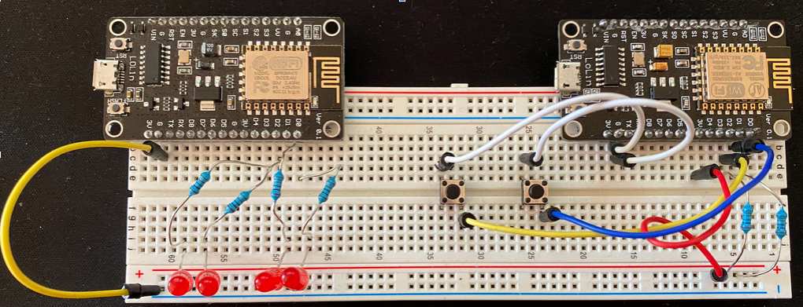

# Intermitentes para patinetes y bicicletas

Esta práctica se compone de dos dispositivos, un sistema vestible y un mando. En la siguiente foto se muestra una idea de lo que se quiere implementar:

Como se puede observar, el casco tendría dos luces (en mi caso dos tiras led) con un controlador y batería, además en el manillar enganchado un dispositivo con dos botones para señalar a qué dirección se quiere girar.

## Componentes

Para el proyecto se necesitan los siguientes materiales:
2 placas ESP8266 con wifi
Luces (yo he utilizado bombillas porque no me han llegado las tiras led)
Resistencias de 1kΩ
Cables
2 baterías externas o powerbank (pequeñas)
Protoboard

## Esquema de conexión del proyecto:

En este caso como Tinkercad no tiene placas ESP8266 he intentado hacer el diagrama lo más básico con dos placas Arduino. Lo malo de estas sería la conexión entre ellas, ya que las que utilizo tienen un chip wifi.
Foto del montaje en una protoboard

Debido al Covid, los pedidos en general están tardando más tiempo en llegar. Tenía pedido una tira led programable para montarla en el casco, pero hice la prueba de concepto con este circuito.

## Funcionamiento

El funcionamiento de manera externa, se basa en pulsar un botón de la placa y que las dos luces correspondientes se iluminen como si fuese un intermitente.

De manera interna es más complejo debido al problema de la conectividad.
Ambas placas tienen un chip wifi, y para su comunicación no podemos depender de un router externo, por tanto con la biblioteca ESP8266WiFi, una de ellas hace de router (la de las luces), siendo la otra el cliente.
Además, la que hace de router tiene un servidor web, la cual recibe peticiones del cliente, y en esta le va mandando los estados de los botones.
Como los recibe como una url, en formato json, con la librería ArduinoJson, los valores recibidos se obtienen (un parse) y según lo recibido se enciende uno u otro.

## Código

- [Cliente](client.ino)
- [Servidor](server.ino)

## Referencias

- [Hackster by Hammad Iqbal](https://www.hackster.io/hammadiqbal12/esp8266-to-esp8266-direct-communication-bf96ce)
- [ArduinoJson](https://arduinojson.org/)
- [ESP8266Wifi](https://arduino-esp8266.readthedocs.io/en/latest/esp8266wifi/readme.html)
- [Tinkercad](https://tinkercad.com/)